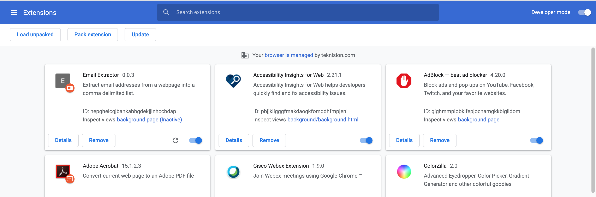
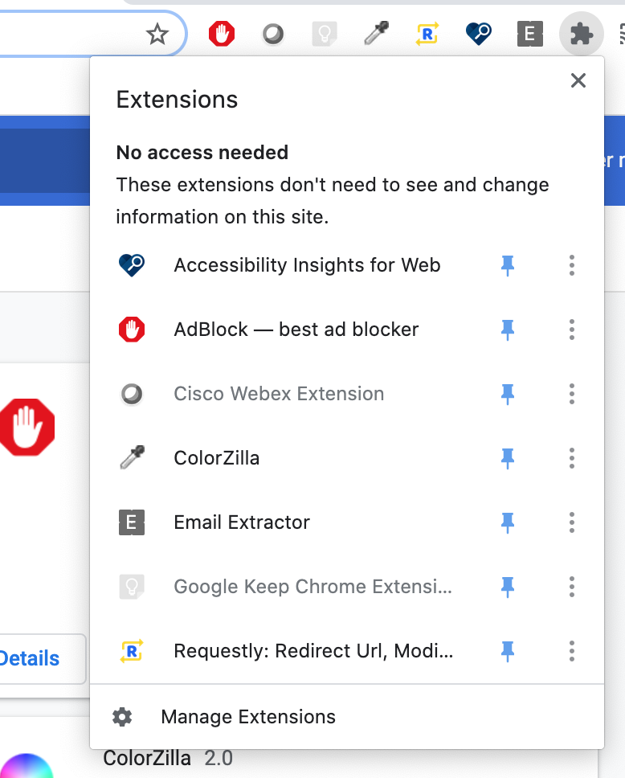
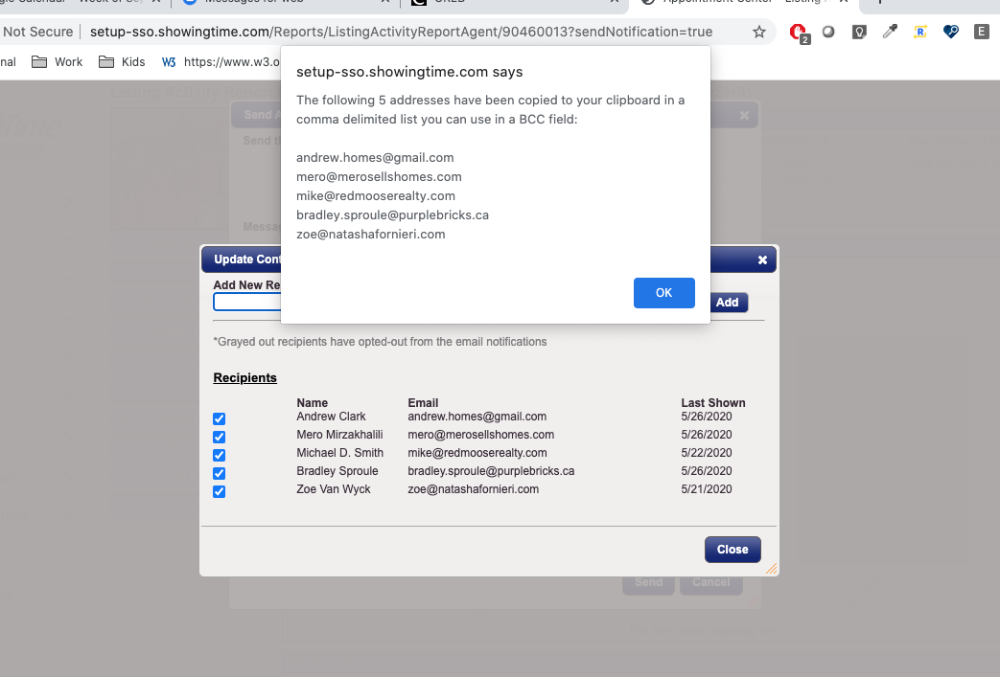

## Installing the Extension

Here are the steps to installing the demo of the Email Extracor Chrome Extension:

* Download the [extension zip file](email-extractor.zip).
* Unzip the directory, on your local machine.
* Open the Chrome browser.
* In the location bar enter the url: `chrome://extensions/`
* Turn **Developer Mode** on.
* Click the button labelled **Load Unpacked**.
* Select the directory that you unzipped.

At this point you should see the following extension added to you extension list: 

## Activating the Extension

Now that the Extension is installed, we are going to add it to the toolbar for easy access:

* In the top right of your browser window, click the extensions icon. It looks like a puzzle piece: 
* Click the pin icon to the right of Email Extractor.
* This adds the extension to the toolbar so you can use it on any page just by pressing the **E** icon.

## Using the Extension

Now that you have it installed and activated, you can use the extension whenever a table of email addresses is displayed to you

When the list is visible to you, press the **E** button, and you will be presented with a popup that will tell you which email addresses were copied to the clipboard.

If you toggle the checkboxes on and off, it will affect which emails are copied to the clipboard.